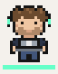
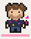

# Code. Create. Explore.

I'm Serkan, a **Frontend / Creative Developer**. I use code, AI and design to turn ideas into products, tools, characters and digital experiences.

###  Code

I've been building frontend products since 2014, primarily in e-commerce. I care about readable systems, measurable performance, accessible interfaces and the small decisions that survive production.

###  Create

I explore AI as a material for new interfaces and forms of storytelling. My work moves between product development, creative coding, digital characters and practical experiments.

###  Explore

Curiosity is usually the starting point. Travel, books, astronomy and everyday observations shape how I think, what I notice and what I make.

I like breaking complex things into understandable parts, testing assumptions and taking ideas all the way from first sketch to a working experience.

---

[Website](https://serkanuslu.com) ·
[About](https://serkanuslu.com/en/about) ·
[LinkedIn](https://www.linkedin.com/in/serkan-uslu/) ·
[Writing](https://medium.com/@serkan-uslu) ·
[Product Hunt](https://www.producthunt.com/@serkanuslu) ·
[Email](mailto:info@serkanuslu.com)
