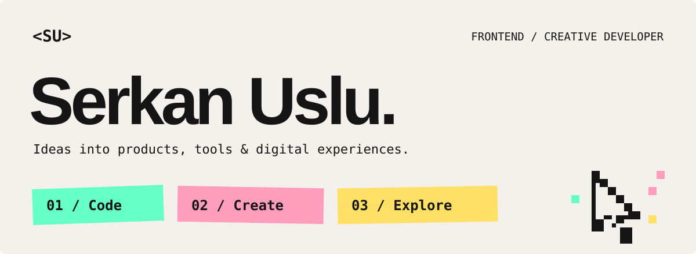

# Serkan Uslu

### Frontend / Creative Developer

I turn ideas into products, tools and digital experiences using code, AI and design.

Frontend since 2014, with a background in e-commerce and frontend leadership. I care about fast, accessible interfaces, understandable systems, and the details that make a product feel right.

[Website ↗](https://serkanuslu.com) · [LinkedIn](https://www.linkedin.com/in/serkan-uslu/) · [Writing](https://medium.com/@serkan-uslu) · [Email](mailto:info@serkanuslu.com)

---

## 01 / Code

Products and practical tools, from the interaction model to the working interface.

| Project | What I’m building |
| :--- | :--- |
| **[TalkTree ↗](https://www.talktree.ai/)** · Code + Create | A branching AI conversation workspace. I shaped the idea, interaction model and frontend so alternative paths stay connected without losing the original conversation. |
| **[Tell-We ↗](https://tell-we.vercel.app/)** · Code + Create | Programmatic AI video and storytelling. I design the product and build the rendering pipeline, bringing text, generated assets and React-based video together. |
| **[Lucid Disk ↗](https://github.com/serkan-uslu/lucid-disk)** · Code | A disk analysis app for Mac, built with Swift. My current focus: making storage easier to understand. Source available here on GitHub. |

## 02 / Create

AI as raw material for characters, stories and interactive experiences—not just another chat box.

- **[Fikry ↗](https://asktofikry.vercel.app/)** — An intentionally unreliable AI companion in a retro CRT interface. Character design meets creative coding and a reactive Three.js character.
- **[Sadi ↗](https://www.youtube.com/@TheLastFrontEndDeveloper)** — The last frontend developer: a fictional character exploring the future of development through AI-assisted storytelling and comedy.
- **[Fallama ↗](https://fallama.com)** — A fortune-telling llama with a world of its own. I carry the character, humor and product experience across web, mobile and social content.

## 03 / Explore

New places, ideas and ways of making things. Curiosity is where most of my work begins—and not everything needs to become a product.

I write about what I notice along the way, from building AI products to traveling through Denmark, Sweden and Norway.

[Explore my website ↗](https://serkanuslu.com) · [Read the TalkTree story ↗](https://medium.com/@serkan-uslu/talktree-a-new-way-to-talk-with-artificial-intelligence-40340424969e)

---

### Tools I work with

**Web & mobile** — TypeScript, React, Next.js, React Native / Expo

**Creative development** — Three.js, Remotion

**AI workflows** — AI SDK, Ollama, ComfyUI

### Say hi

An idea, a project, or just hello.

[serkanuslu.com ↗](https://serkanuslu.com) · [info@serkanuslu.com](mailto:info@serkanuslu.com)
